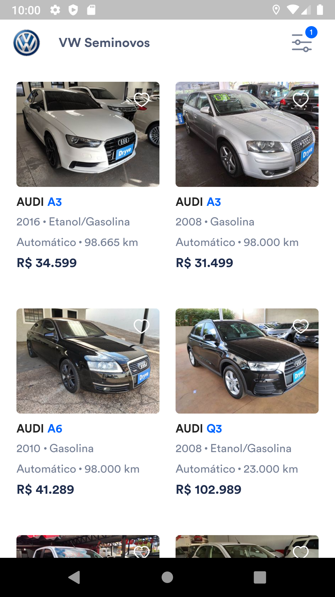
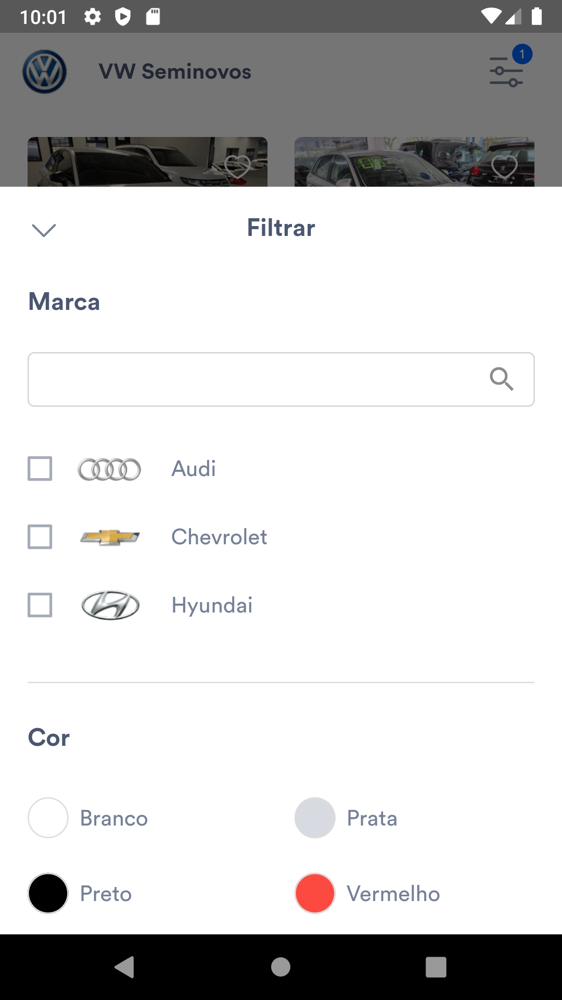

# CARS
## Screens

 Listing Cars             |  Car Filter             |                 
:-------------------------:|:-------------------------:
  |     
## Funcionalidades
- Listagem de carros  
- Filtro por Cor  
- Filtro por Marca  
- Alguns testes unitários
## Estrutura de pastas


```  
lib  
└───reference  
│   └───features  
│   │	└───feature1  
│   │  	│   └───sub_feature  
│   │   │   └───data  
│   │   │   └───domain  
│   │   │   └───external  
│   │   │   └───presenter  
│   │   └───feature2  
│   │  	│   └───sub_feature  
│   │  	│   └───data  
│   │  	│   └───domain  
│   │  	│   └───external  
│   │  	│   └───presenter  
│   app_module.dart  
│   app_widget.dart 
```  
## Arquitetura do projeto
-   Clean Architecture
## Libs
- dartz:
	- Usado para auxilar no tratamento de erros.
- dio: 
	- Usado para requisições WEB
- mockito: 
	- Usado para mocar os dados nos testes unitários
- bloc: 
    - Principal gerenciamento de estado da aplicação 
- get_it:
	- Injeção de dependências
- flutter_money_formatter:
	-  Usado apenas nos itens do feed para apresentar os campos de moeda e valor do veiculo
- flutter_svg:
    - Usado para renderizar imagens svg
## Dispositivos usados nos testes
- Android: 
	- Moto G6
	-  Moto G5
	-  Pixel 2 (Emulador)
- IOS: 
	-  Não testado
